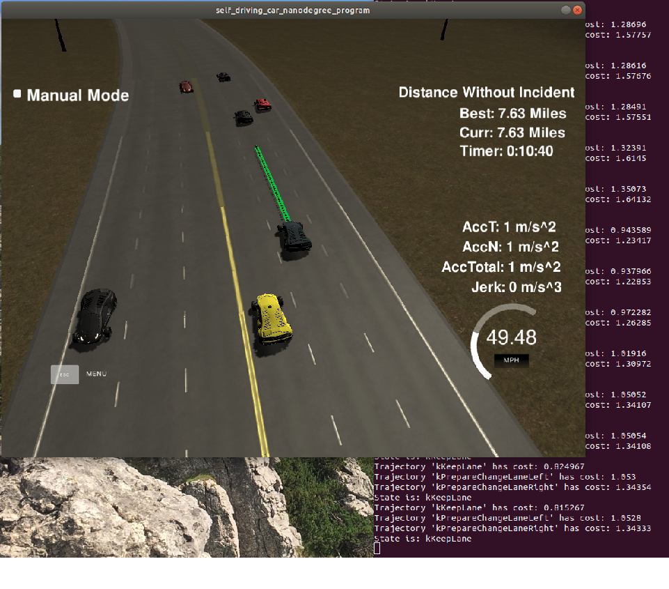
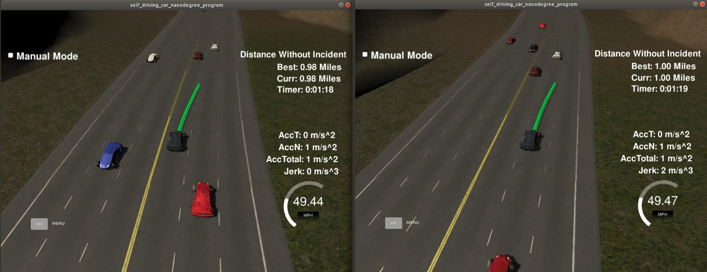

# CarND-Path-Planning-Project

**Self-Driving Car Engineer Nanodegree Program**

## Overview

### Goal

In this project the goal is to safely navigate around a virtual highway with other traffic that is driving +-10 MPH of the 50 MPH speed limit. You will be provided the car's localization and sensor fusion data, there is also a sparse map list of waypoints around the highway. The car should try to go as close as possible to the 50 MPH speed limit, which means passing slower traffic when possible, note that other cars will try to change lanes too. The car should avoid hitting other cars at all cost as well as driving inside of the marked road lanes at all times, unless going from one lane to another. The car should be able to make one complete loop around the 6946m highway. Since the car is trying to go 50 MPH, it should take a little over 5 minutes to complete 1 loop. Also the car should not experience total acceleration over 10 m/s^2 and jerk that is greater than 10 m/s^3.

### Sample Results

Images below show examples on the planner being able to drive longer than expected to meet the specifications, and the car working on lane change maneuvers.





### Contents

- [Execution](#execution)
- [Input Data](#input-data)
- [Model Documentation](#model-documentation)
- [Future Improvements](#future-improvements)

## Execution

### Dependencies

* cmake >= 3.5
  * All OSes: [click here for installation instructions](https://cmake.org/install/)
* make >= 4.1
  * Linux: make is installed by default on most Linux distros
  * Mac: [install Xcode command line tools to get make](https://developer.apple.com/xcode/features/)
  * Windows: [Click here for installation instructions](http://gnuwin32.sourceforge.net/packages/make.htm)
* gcc/g++ >= 5.4
  * Linux: gcc / g++ is installed by default on most Linux distros
  * Mac: same deal as make - [install Xcode command line tools]((https://developer.apple.com/xcode/features/)
  * Windows: recommend using [MinGW](http://www.mingw.org/)
* [uWebSockets](https://github.com/uWebSockets/uWebSockets)
  * Run either `install-mac.sh` or `install-ubuntu.sh`.
  * If you install from source, checkout to commit `e94b6e1`, i.e.
    ```
    git clone https://github.com/uWebSockets/uWebSockets 
    cd uWebSockets
    git checkout e94b6e1
    ```

### Third Party

Two libraries have been embeeded into the project src:
- [spline](http://kluge.in-chemnitz.de/opensource/spline/): Allows generating continuous trajectories along the road.
- [tinyfsm](https://github.com/digint/tinyfsm): Allows declaring the behavioral planning state machine.


### Simulation

You can download the Term3 Simulator which contains the Path Planning Project from the [releases tab (https://github.com/udacity/self-driving-car-sim/releases/tag/T3_v1.2).

To run the simulator on Mac/Linux, first make the binary file executable with the following command:
```shell
sudo chmod u+x {simulator_file_name}
```

1. The car uses a perfect controller and will visit every (x,y) point it recieves in the list every .02 seconds. The units for the (x,y) points are in meters and the spacing of the points determines the speed of the car. The vector going from a point to the next point in the list dictates the angle of the car. Acceleration both in the tangential and normal directions is measured along with the jerk, the rate of change of total Acceleration. The (x,y) point paths that the planner recieves should not have a total acceleration that goes over 10 m/s^2, also the jerk should not go over 50 m/s^3.

2. There will be some latency between the simulator running and the path planner returning a path, with optimized code usually its not very long maybe just 1-3 time steps. During this delay the simulator will continue using points that it was last given, because of this its a good idea to store the last points you have used so you can have a smooth transition. previous_path_x, and previous_path_y can be helpful for this transition since they show the last points given to the simulator controller with the processed points already removed. You would either return a path that extends this previous path or make sure to create a new path that has a smooth transition with this last path.


### Build

```bash
1. Clone this repo.
2. Make a build directory: `mkdir build && cd build`
3. Compile: `cmake .. && make`
4. Run it: `./path_planning`.
```

## Input Data
### The Map

Is provided in `data/highway_map.txt` as a collection of waypoints. Each `[x,y,s,dx,dy]` values. `x` and `y` are the waypoint's map coordinate position, the `s` value is the distance along the road to get to that waypoint in meters, the `dx` and `dy` values define the unit normal vector pointing outward of the highway loop.

The highway's waypoints loop around so the frenet `s` value, distance along the road, goes from `0` to `6945.554`.

### Telemetry

The simulator provides telemetry information in json format through a web socket. This is handled in `main.cpp`.

```
# Main car's localization Data (No Noise)
["x"] The car's x position in map coordinates
["y"] The car's y position in map coordinates
["s"] The car's s position in frenet coordinates
["d"] The car's d position in frenet coordinates
["yaw"] The car's yaw angle in the map
["speed"] The car's speed in MPH

# Previous path data given to the Planner
# Return the previous list but with processed points removed.
["previous_path_x"] The previous list of x points previously given to the simulator
["previous_path_y"] The previous list of y points previously given to the simulator

# Previous path's end s and d values 
["end_path_s"] The previous list's last point's frenet s value
["end_path_d"] The previous list's last point's frenet d value

# Sensor Fusion Data: a list of all other car's attributes on the same side of the road. (No Noise)
["sensor_fusion"] A 2d vector of cars and then that car's [car's unique ID, car's x position in map coordinates, car's y position in map coordinates, car's x velocity in m/s, car's y velocity in m/s, car's s position in frenet coordinates, car's d position in frenet coordinates. 
```

## Model Documentation

### Input Data

Telemetry data is provided through a websocket with the simulator, and comes in JSON format. Map specifications are provided in a CSV file. Deserialization of both messages is implemented in `serialization.h`.

### Prediction

The current vehicle's frenet coordinate `s` is extrapolated in time using a constant speed motion model.

The implementation does not consider vehicle tracking and prediction of lane changes. This is a shortcomming of the implementation. Lane changes executed by others could lead to collisions.

Based on telemetry information, each object is converted into a `Vehicle` containing  the following information:
- ID
- Frenet coordinates: `d`, `s`.
- Speed.
- Lane ID.
- Distance to ego.
- Predicted `s`.
- Predicted distance to ego.
- Predicted frenet path.
- Checks: *is vehicle ahead*, *is vehicle behind*, and *is vehicle near*.

Also, for each lane the following is computed:
- Nearest vehicle ahead.
- Nearest vehicle behind.
- Lane speed.

### Trajectory Generation

Following the advices from the lectures, the trajectory generation is based on splines. This helps ensuring the continuity of the points. 

Instead of reusing the previous trajectory completely, only a few points are kept. The remaining points are generated at each step. This helps esuring a quick response of the vehicle.

A set of anchors is computed based on the selected points from the previous trajectory. In cases were this is empty, the current car position is used as anchor. See `TrajectoryGenerator::updateAnchorReference()`.

Before generating the spline, all anchors are transformed to the ego frame, helping to ensure the data in x axis is as horizontal as possible. The spline is then used to interpolate the trajectory points as needed. These are spaced to accomodate for the desired speed.

The `TrajectoryGenerator` class provides generation of different trajectory actions in the `getTrajectoryForAction()` method. Depending on the case, the anchors can be created on the current lane (keep lane, prepare lane change), or in a different lane (lane change). The lane change is only executed if there is a valid gap in the next lane where the car can fit (See: `TrajectoryGenerator::isLaneChangePossible`).

The trajectory speed is controlled based on the desired speed (49.5 mph), the speed limit (50 mph), and the speed of the objects around. The velocity is increased whenever possible, and decreased if there is an object in front. If the car is preparing for a lane change, then the speed is also adjusted to match the velocity of the slowest between both lanes. See `TrajectoryGenerator::getOptimalSpeed()`.

### State Machine

The state machine considers 5 states, as adviced in the lessons, were the only way to execute a lane change is to prepare for it beforehand:
- KeepLaneState
- PrepareLaneChangeLeftState
- PrepareLaneChangeRightState
- LaneChangeLeftState
- LaneChangeRightState

The states are implemented in `src/state_machine.h`, and trajectory evaluation is implemented in `trajectory_validator.h`.

During each step, only trajectories for next possible states are generated. These are further evaluated to check for validity and cost. The transition is executed based on the trajectory with the lowest cost, if any. The transition logic is implemented in `StateMachine::react()`.

At the moment, two validations are implemented: `TrajectoryValidator::isActionLaneValid()`, which negates lane changes outside the road. And `TrajectoryValidator::isCollisionPredictedInLaneChange()`, which invalidades any ane change trajectory leading to collisions at any point in time.

The same cost functions studied in the lessons were implemented: `SpeedCostFunction`, `GoalDistanceCostFunction`, and `InefficientLaneCostFunction`. Also, the `PreferEmptyLaneCostFunction` was added, as a linear decreasing cost, depending on the distance to obstacles on the intended lane.

In order to avoid quick succesion of KeepLane <-> PrepareLaneChangeX transitions, a debounce timer was added (see `StateMachine::isDebounceTimeout()`). This provides a more stable sequence of states.


### Output Data

The planner (see `motion_planning.h`) triggers the state machine update on each step. The selected trajectory is based on the final state. This is converted back to json and forwarded to the simulator. See also: `MotionPlanning::step()`. 


### Source files

The source code is located in the `src/` directory:
- `third_party/`: Third party code: json, spline and tinyfsm libraries.
- `data_types.h` and `trajectory.h`: Declare all data types used in the project.
- `helpers.h`: Helper functions.
- `main.cpp`: Entry point. Receives telemetry, triggers motion planning, sends trajectories.
- `motion_planning.h`: Triggers the state machine and provides selected trajectories.
- `prediction.h`: Vehicle prediction module.
- `serialization.h`: Conversion from json/csv to project data types.
- `state_machine.h`: Behavior planning state machine.
- `trajectory_generator.h`: Spline based trajectory generation.
- `trajectory_validator.h`: Trajectory validation and cost computation.


## Future Improvements

- Ensure car is centered on the lane at all times, even on tight turns.
- Implement KeepDistance behaviour. For instance, a control window can be used (lets say ~40 meters), and a speed-based distance controller to keep distance constant (lets say ~30 m). This would avoid intermitent slow downs.
- Predict lane changes of vehicles, so that the car can react on time.
- Add extra cost functions.

